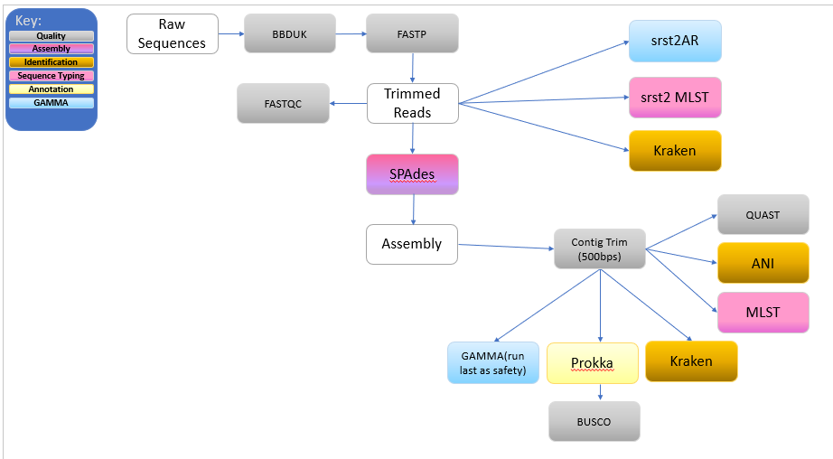
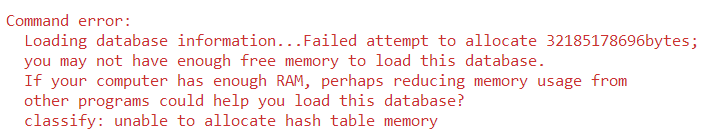

## <div align="center"> Getting Started</div>

1. Install [`Nextflow`](https://www.nextflow.io/docs/latest/getstarted.html#installation) (`>=21.10.3`)

2. Install [`Singularity`](https://www.sylabs.io/guides/3.0/user-guide/)

4. Start running your own analysis!

    <!-- TODO nf-core: Update the example "typical command" below used to run the pipeline -->

    ```console

    nextflow run main.nf -profile singularity  --input <path_to_samplesheet.csv> --outdir <path_to_results_directory>

    ```

**Please specify a directory for your results if you'd like to keep data for long term storage. Omitting the <--outdir> command will require the user to copy the pipeline results directory to the desired directory. This can consume a large amount of time when more than 5 samples are run.**
## <div align="center">Running Quaisar:</div>
-------------------------------------------------------------------------------------------------------------------------------------------------------
**Note:** First-time users will need to run the following command and allow the required databases to download:
    ```console
    nextflow run nf-core/quaisar -profile singularity -entry <databasedownloads>
    ```

## <div align="center">Pipeline summary:</div>
-------------------------------------------------------------------------------------------------------------------------------------------------------
<!-- TODO nf-core: Fill in short bullet-pointed list of the default steps in the pipeline -->
-------------------------------------------------------------------------------------------------------------------------------------------------------
### Preprocessing of Raw Reads
1. PhiX adapter trimming and filtering of reads using BBDuK ([`BBDuK`](https://github.com/BioInfoTools/BBMap))
2. Read filtering, adapter trimming, quality profiling and base correction using fastp ([`fastp`](https://github.com/OpenGene/fastp))
3. Raw Reads QC Assessment specifics found in "QC Summary by Read Processing State" section

--------------------------------------------------------------------------------------------------------------------------------------------------------
--------------------------------------------------------------------------------------------------------------------------------------------------------
#### <div align="center">*T Denotes Trimmed Reads that Were Not Assembled</div>
#### <div align="center">*A Denotes Reads that Proceed to Assembly</div>
--------------------------------------------------------------------------------------------------------------------------------------------------------
--------------------------------------------------------------------------------------------------------------------------------------------------------

### Analysis of Trimmed Reads
--------------------------------------------------------------------------------------------------------------------------------------------------------
4T. Gene detection and allele calling for antibiotic resistance, virulence (adding hypervirulence genes beyond their mention in the alerts section?), and/or plasmids using srst2 AR ([`srst2 AR`](https://github.com/katholt/srst2)) <br>
5T. Report sequence types based on MLST alleles and profile definitions using srst2 MLST ([`srst2 MLST`](https://github.com/katholt/srst2)) <br>
6T. Kraken2 ([`Kraken2`](https://github.com/nf-core/modules/tree/master/modules/kraken2/kraken2))<br>

### Assembly
--------------------------------------------------------------------------------------------------------------------------------------------------------
5. Assemby of trimmed reads using SPAdes ([`SPAdes`](https://github.com/ablab/spades))<br>
### Analysis of Assembled Reads >= 500bps
--------------------------------------------------------------------------------------------------------------------------------------------------------
4A. Assess assembly quality using QUAST ([`QUAST`](https://github.com/ablab/quast)) <br>
5A. Measure the nucleotide-level coding region similarity (between genomes) using fastANI ([`fastANI`](https://github.com/ParBLiSS/FastANI))<br>
6A. Type multiple loci to characterize isolates of microbial species using MLST ([`MLST`](https://github.com/tseemann/mlst))<br>
7A. Detect hypervirulence genes and find best matches to untranslated genes from a gene database using GAMMA ([`GAMMA`](https://github.com/rastanton/GAMMA))<br>
9A. Rapid whole genome annotation using Prokka ([`PROKKA`](https://github.com/tseemann/prokka))<br>
10A. Assess genome assembly for completeness using BUSCO ([`BUSCO`](https://busco.ezlab.org/))<br>
11A. KRAKEN2 ([`Kraken2`](https://github.com/nf-core/modules/tree/master/modules/kraken2/kraken2))<br>


<!-- Add conditional statement to workflow nf files to differentiate-->
### Format Results of Analysis

### QC Summary by Read Processing State

<!-- TODO nf-core: Fill in short bullet-pointed list of the default steps in the pipeline -->
#### Raw Reads
1. Trimmed & assembled read QC ([`FastQC`](https://www.bioinformatics.babraham.ac.uk/projects/fastqc/))<br>
2. Software versions list ([`MultiQC`](http://multiqc.info/))


## Troubleshooting
Users may encounter exended lag time and/or issues connecting to certain databases. This can commonly occur while running the
pipeline on a cluster. Please confirm that your HPC environment is not experiencing technical issues, updates, and/or downtimes
that impact functionality if these types of errors occur.

Specifically, this error indicates that the user will need additional memory in order to run Kraken2.


## Documentation


The nf-core/quaisar pipeline comes with documentation about the pipeline [usage](https://nf-co.re/quaisar/usage), [parameters](https://nf-co.re/quaisar/parameters) and [output](https://nf-co.re/quaisar/output).

## Credits

nf-core/quaisar was originally written by Rich Stanton, Nick Vlachos, Alyssa Kent, Maria Diaz, and Jill Hagey.


We thank the following people for their extensive assistance in the development of this pipeline:

<!-- TODO nf-core: If applicable, make list of people who have also contributed -->

## Contributions and Support

If you would like to contribute to this pipeline, please see the [contributing guidelines](.github/CONTRIBUTING.md).

For further information or help, don't hesitate to get in touch on the [Slack `#quaisar` channel](https://nfcore.slack.com/channels/quaisar) (you can join with [this invite](https://nf-co.re/join/slack)).


## Citations

<!-- TODO nf-core: Add citation for pipeline after first release. Uncomment lines below and update Zenodo doi and badge at the top of this file. -->

<!-- If you use  nf-core/quaisar for your analysis, please cite it using the following doi: [10.5281/zenodo.XXXXXX](https://doi.org/10.5281/zenodo.XXXXXX) -->


<!-- TODO nf-core: Add bibliography of tools and data used in your pipeline -->
An extensive list of references for the tools used by the pipeline can be found in the [`CITATIONS.md`](CITATIONS.md) file.

You can cite the `nf-core` publication as follows:

> **The nf-core framework for community-curated bioinformatics pipelines.**
>
> Philip Ewels, Alexander Peltzer, Sven Fillinger, Harshil Patel, Johannes Alneberg, Andreas Wilm, Maxime Ulysse Garcia, Paolo Di Tommaso & Sven Nahnsen.
>
> _Nat Biotechnol._ 2020 Feb 13. doi: [10.1038/s41587-020-0439-x](https://dx.doi.org/10.1038/s41587-020-0439-x).


## Introduction (Needs to be developed then will move to top of page)

<!-- TODO nf-core: Write a 1-2 sentence summary of what data the pipeline is for and what it does -->

**nf-core/quaisar** is a bioinformatics best-practice analysis pipeline for Quality, Assembly, Identification, Sequencing Typing, Annotation and Resistance mechanisms.


The pipeline is built using [Nextflow](https://www.nextflow.io), a workflow tool to run tasks across multiple compute infrastructures in a very portable manner. It uses Docker/Singularity containers making installation trivial and results highly reproducible. The [Nextflow DSL2](https://www.nextflow.io/docs/latest/dsl2.html) implementation of this pipeline uses one container per process which makes it much easier to maintain and update software dependencies. Where possible, these processes have been submitted to and installed from [nf-core/modules](https://github.com/nf-core/modules) in order to make them available to all nf-core pipelines, and to everyone within the Nextflow community!

<!-- TODO nf-core: Add full-sized test dataset and amend the paragraph below if applicable -->

On release, automated continuous integration tests run the pipeline on a full-sized dataset on the AWS cloud infrastructure. This ensures that the pipeline runs on AWS, has sensible resource allocation defaults set to run on real-world datasets, and permits the persistent storage of results to benchmark between pipeline releases and other analysis sources. The results obtained from the full-sized test can be viewed on the [nf-core website](https://nf-co.re/quaisar/results)
